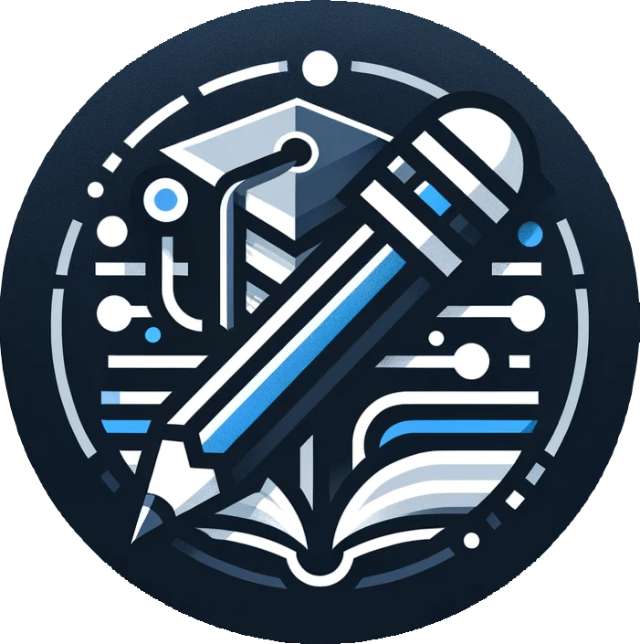

# Tuto-U

**El conocimiento ya está en el campus. Solo hay que conectarlo.**

Plataforma de tutorías entre pares para comunidades universitarias.

---

## 🎯 La idea

En cada campus hay una persona que **ya aprobó Cálculo I con nota alta**. Y hay otra que, en este mismo momento, está trabada en límites a las once de la noche.

Las dos caminan por los mismos pasillos. Comen en el mismo comedor. Probablemente se han cruzado esta semana.

Y aun así, no se encuentran.

Ese conocimiento existe, es local, es gratuito o casi, y hoy se coordina como se puede: grupos de Facebook o WhatsApp, el clásico *"oye, ¿tú no llevaste esta materia el semestre pasado?"*.

**Tuto-U convierte ese caos en infraestructura.**

> ### Nuestro objetivo
> **Crear entornos de aprendizaje colaborativo en los campus.**
>
> No un marketplace. No una academia. Una red donde el conocimiento circula
> horizontalmente entre estudiantes de una misma comunidad — donde quien
> aprendió ayer enseña hoy, y quien enseña hoy sigue aprendiendo mañana.

Empezamos en **Yachay Tech (Ecuador)** porque ahí nacimos y ahí entendemos el problema. Pero la arquitectura está pensada para que a futuro cualquier universidad que quiera construir su propio ecosistema colaborativo pueda hacerlo con nosotros.

---

## ✨ Qué hace

### Para quien necesita ayuda

| | |
|---|---|
| 🔍 **Explora** | Busca asignaturas y filtra por escuela |
| 📅 **Agenda** | Mira la disponibilidad y reserva con al menos 8 horas de anticipación |
| 💬 **Define** | Elige duración (de 30 min a 3 h), modalidad (presencial u online) y el tema puntual de tu duda |
| ⭐ **Califica** | Valora la sesión al terminar y ayuda a que la comunidad sepa a quién acudir |

### Para quien quiere enseñar

| | |
|---|---|
| 📚 **Elige tus materias** | Selecciona los cursos en los que te sientes fuerte |
| 🗓️ **Define tu horario** | Marca tu disponibilidad semanal, franja por franja |
| 💵 **Pon tu tarifa** | Precios por duración — y sí, **$0 es una opción válida**: hay tutores voluntarios |
| ✅ **Decide** | Acepta o rechaza cada solicitud; nadie te asigna nada automáticamente |

### Para toda la comunidad

- 🏆 **Logros** — un sistema de reconocimientos por enseñar, aprender y colaborar
- 📄 **Syllabus colaborativo** — sube el programa de una materia y desbloquea un logro
- 🛡️ **Reportes** — si algo sale mal, hay un canal formal, no un vacío

---

## 🔐 Confianza por diseño

Una plataforma donde estudiantes se encuentran con estudiantes tiene que ganarse la confianza antes de pedirla. Estas decisiones no son accesorias, son el producto:

- **Solo correo institucional.** El acceso está restringido a direcciones `@yachaytech.edu.ec`. No es una barrera burocrática: es lo que garantiza que estás hablando con alguien de tu propia comunidad.
- **Los datos de contacto no son públicos.** El correo y el WhatsApp de la contraparte se revelan **únicamente cuando una sesión fue aceptada**. Nadie puede recolectar contactos navegando perfiles.
- **La identidad nunca viaja desde el cliente.** Cada operación del servidor deriva quién eres desde la sesión autenticada, jamás de un parámetro enviado por el navegador.
- **Verificación de correo.** Un código de 6 dígitos confirma que la cuenta realmente te pertenece.
- **Moderación real.** Panel interno para revisar reportes y métricas de la comunidad — porque recibir un reporte y no poder actuar sobre él no es moderar.

---

## 🧱 Stack

| Capa | Tecnología |
|---|---|
| **Framework** | Next.js 16 (App Router, Server Components) + React 19 |
| **Lenguaje** | TypeScript |
| **Base de datos** | PostgreSQL + Prisma 7 (driver adapter `@prisma/adapter-pg`) |
| **Autenticación** | Auth.js v5 (sesiones JWT + PrismaAdapter) |
| **UI** | Tailwind CSS + shadcn/ui sobre Radix |
| **Formularios** | React Hook Form + Zod |
| **Correo** | Resend + React Email |
| **Gráficos** | Recharts |
| **Tests** | Vitest |
| **Gestor de paquetes** | pnpm |
| **Deploy** | Vercel |

---

## 🗺️ Hacia dónde va

El modelo de datos ya contempla **múltiples universidades** (`University`, resolución de identidad por dominio de correo), aunque hoy la validación esté fijada a Yachay Tech de forma intencional.

La visión a mediano plazo: probar cada funcionalidad en el ecosistema real de Yachay Tech, aprender de datos reales, y luego ofrecer una plataforma madura a otras universidades que quieran construir **su propio entorno de aprendizaje colaborativo** en el campus.

Ideas en el radar: recordatorios de sesión, mensajería interna, sesiones recurrentes, lista de espera para materias sin cobertura, panel de ingresos para tutores y onboarding autoservicio para nuevas universidades.

---

## 👥 Equipo

Tuto-U es un proyecto construido por estudiantes de Yachay Tech, para estudiantes de Yachay Tech. Conoce a quienes lo hacen posible en la sección **[Nuestro Equipo](https://tutou.app/ourteam)** de la plataforma.

---

**Aprende. Enseña. Conecta.**

*Hecho con ☕ y noches de estudio en Urcuquí, Ecuador.*

